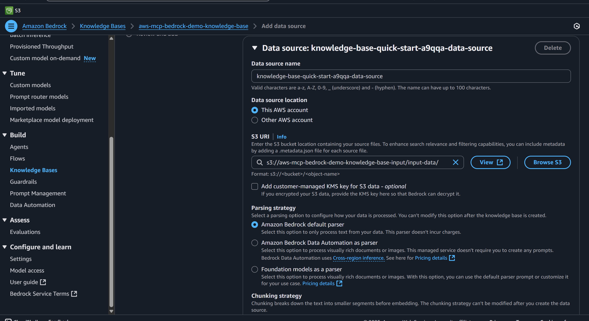

# AWS Bedrock Knowledge Bases MCP Client + OpenSearch Vector Database

# Setup Steps

1. Download and install the AWS CLI `https://docs.aws.amazon.com/cli/latest/userguide/getting-started-install.html`
2. Navigate to IAM and create an user, attach an admin policy
3. Click on the user and go to the `Security credentials` tab
4. Login to AWS from the console `aws configure` and add the credentials
5. Install OpenTofu and check version `tofu --version`
6. Initialize OpenTofu project `tofu init`
7. Get credentials using `cat ~/.aws/credentials`
9. Apply `tofu apply`
10. The apply will partially failed due to the index in OpenSearch only being able to be created manually. Go to the console (https://us-east-1.console.aws.amazon.com/aos/home?region=us-east-1#opensearch/collections/aws-mcp-bedrock-demo-collection) and create it manually with the following values,

11.  Apply `tofu apply` to create and connect the knowledge base to the opensearch collection.
12. The next manual step is ingesting the data from S3 directly into the knowledge base. Go to https://us-east-1.console.aws.amazon.com/bedrock/home?region=us-east-1#/knowledge-bases/aws-mcp-bedrock-demo-knowledge-base/DJRGL65TVU/ and click `Add`
13. Search and add the folder containing CSVs as follows

14. Go to the Bedrock Model Access Dashboard and enable the following models

15. Click on the source and then click `Sync`
16. Test it by going to the playground at http://us-east-1.console.aws.amazon.com/bedrock/home?region=us-east-1#/knowledge-bases/aws-mcp-bedrock-demo-knowledge-base/, select the model `Cloude Sonnet 3.7` and a prompt like `Find me all transactions done in New York` and the output is as follows,

17. To test using the created lambda, navigate to https://us-east-1.console.aws.amazon.com/lambda/home?region=us-east-1#/functions/aws-mcp-bedrock-demo-bedrock-invoke?tab=testing, and click `Test

18. To save on cost I recommend deleting the most costly components, the knowledge base and the opensearch vector database after each test. Do it in the following order to avoid errors,

  - `tofu destroy --target aws_bedrockagent_knowledge_base.main`
  - `tofu destroy --target aws_opensearchserverless_collection.knowledge_base`