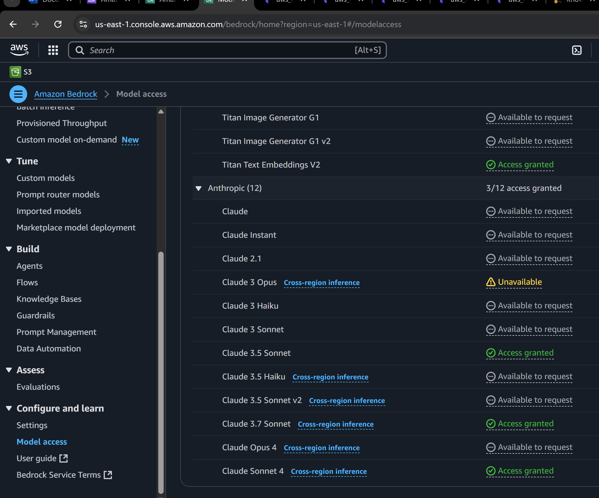
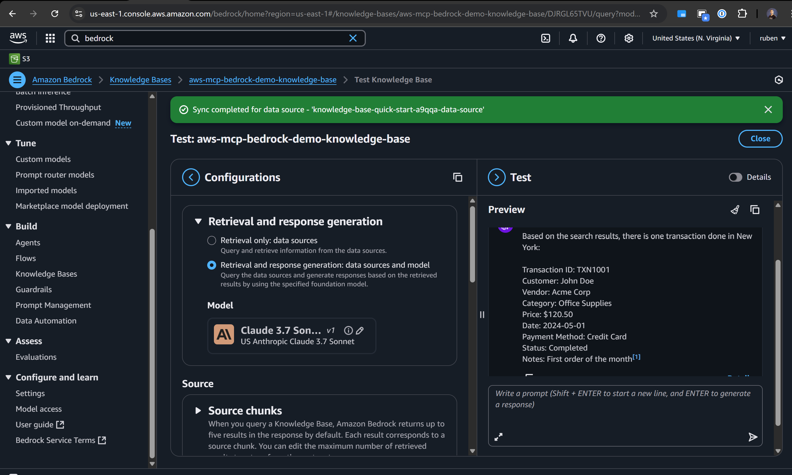
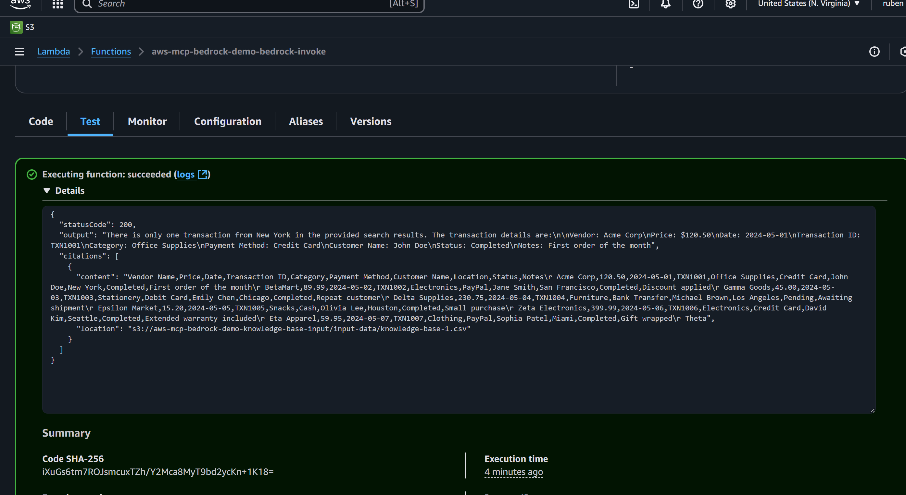

# AWS Bedrock Knowledge Base with RDS PostgreSQL Vector Database

A complete solution for building AI-powered knowledge bases using AWS Bedrock and PostgreSQL with pgvector extension.

## 🚀 Quick Start Guide

### Prerequisites
- AWS CLI installed and configured
- OpenTofu installed
- AWS account with appropriate permissions

### Step-by-Step Deployment

#### Step 1: Deploy Infrastructure (First Pass)
```bash
# Initialize OpenTofu
tofu init

# Deploy infrastructure (this will fail at the end - that's expected!)
tofu apply -auto-approve
```

**⚠️ Expected Failure**: The deployment will fail when creating the Bedrock Knowledge Base because the database hasn't been initialized yet. This is normal and expected.

#### Step 2: Initialize Database
```bash
# Windows PowerShell
powershell -ExecutionPolicy Bypass -File rds-scripts/init-database.ps1

# Linux/Mac
chmod +x rds-scripts/init-database.sh
./rds-scripts/init-database.sh
```

This script will:
- Enable pgvector extension
- Create the `bedrock_vectors` table with UUID primary key
- Create all required indexes (HNSW for vectors, GIN for content)
- Set up functions and triggers
- Grant necessary permissions

#### Step 3: Add Required Indexes
**⚠️ These steps are required** - The database initialization creates basic indexes, but Bedrock requires specific ones:

**Add full-text search index on content column:**
```bash
powershell -ExecutionPolicy Bypass -File rds-scripts/add-content-index.ps1
```

**Add HNSW index on embedding column:**
```bash
powershell -ExecutionPolicy Bypass -File rds-scripts/update-embedding-index.ps1
```

#### Step 4: Complete Infrastructure Deployment
```bash
# Now the Bedrock Knowledge Base should create successfully
tofu apply -target aws_bedrockagent_knowledge_base.main -auto-approve

# Apply the rest
tofu apply -auto-approve
```

#### Step 5: Verify Deployment
```bash
# Check outputs
tofu output

# Test database connection
aws rds-data execute-statement \
  --resource-arn "arn:aws:rds:us-east-1:ACCOUNT:cluster:mcp-demo-vector-store" \
  --secret-arn "arn:aws:secretsmanager:us-east-1:ACCOUNT:secret:mcp-demo-rds-credentials" \
  --database "bedrock_vectors" \
  --sql "SELECT version();"
```

#### Step 6: Upload Data Files
```bash
# Upload CSV and metadata files to S3
powershell -ExecutionPolicy Bypass -File upload-data.ps1
```

This script will upload both your CSV file and its corresponding metadata file to the S3 bucket.

#### Step 7: Sync Knowledge Base
1. Go to the [AWS Bedrock Console](https://console.aws.amazon.com/bedrock/)
2. In the left sidebar, click on **Model access** and ensure the required Bedrock models are enabled for your account.  
   
3. Navigate to **Knowledge bases** in the left sidebar
4. Find your knowledge base named `mcp-demo-knowledge-base`
6. Click on the knowledge base to open its details
6. Click the **Sync** button to populate the knowledge base with data from your S3 bucket
7. After the sync completes, test your knowledge base in the Bedrock Playground:
   - Click the **Test in playground** button on the knowledge base details page
   - Enter a sample question to verify your data is available for retrieval
   - Refer to the screenshot below for guidance:
     
8. Once synced, your knowledge base will be ready for queries with enhanced metadata support

#### Step 8: Test Lambda Function
1. Go to the [AWS Lambda Console](https://console.aws.amazon.com/lambda/)
2. Navigate to **Functions** in the left sidebar
3. Find your Lambda function named `mcp-demo-bedrock-invoke`
4. Click on the function to open its details
5. Click the **Test** tab
6. Click **Create new event** if no test event exists
7. Enter a test name (e.g., "test-bedrock-query")
8. Use the following test event JSON:
   
   **Additional example questions you can test:**
   ```json
   {
     "question": "How many assets exist for 2017 on hvac and what's the average of them?"
   }
   ```
   
   ```json
   {
     "question": "How many assets exist in the year 2018?"
   }
   ```


   
   **Note**: The knowledge base ID is automatically provided via environment variables, so you don't need to specify it in the test event. If you want to override it, you can add `"knowledge_base_id": "your-knowledge-base-id"` to the JSON.
9. Click **Save** and then **Test**
10. Review the execution results to verify the Lambda function is working correctly

## 📁 Project Structure

```
aws-mcp-databases/
├── rds-scripts/           # Database initialization scripts
│   ├── init-database.ps1  # Main database setup (PowerShell)
│   ├── init-database.sh   # Main database setup (Bash)
│   ├── add-content-index.ps1 # Add full-text search index
│   ├── update-embedding-index.ps1 # Update to HNSW index
│   └── database-init.sql  # SQL initialization file
├── bedrock.tf             # Bedrock Knowledge Base
├── rds.tf                 # RDS PostgreSQL cluster
├── vpc.tf                 # VPC and networking
├── s3.tf                  # S3 buckets and website
├── lambda.tf              # Lambda functions
├── knowledge-bases/       # Sample data files
└── website/               # Static website files
```

## 🗄️ Database Schema

The `bedrock_vectors` table includes:
- **id**: UUID primary key (required by Bedrock)
- **content**: Text content for full-text search
- **embedding**: Vector(1024) for similarity search
- **metadata**: JSONB for flexible metadata
- **created_at/updated_at**: Timestamps with auto-update

Required indexes:
- **HNSW index** on embedding column for vector similarity
- **GIN index** on content for full-text search
- **GIN index** on metadata for JSON queries

## 🧪 Testing

### Test Knowledge Base
1. Go to AWS Bedrock Console
2. Navigate to your knowledge base
3. Use the playground to test queries
4. Example: "Find me all transactions done in New York"

### Test Lambda Function
1. Go to AWS Lambda Console
2. Navigate to `mcp-demo-bedrock-invoke`
3. Create a test event and execute

### Test Website
1. Check `.website_info.txt` for the website URL
2. Login with Cognito credentials

## 🔧 Troubleshooting

### Common Issues

**Terraform fails on Bedrock Knowledge Base creation**
- **Cause**: Database not initialized
- **Solution**: Run `rds-scripts/init-database.ps1` first

**Database connection failed**
- Check security group rules
- Verify credentials in Secrets Manager
- Ensure RDS is in private subnets

**Vector extension not available**
- Run the database initialization script
- Check PostgreSQL version compatibility

**Plugin error during deployment**
- **Error**: "Unrecognized remote plugin message"
- **Solution**: Run `tofu init -reconfigure` to fix plugin issues

**Deployment gets halted/interrupted**
- **Cause**: Network issues or AWS API throttling
- **Solution**: Wait a few minutes and retry `tofu apply -auto-approve`

**Secrets Manager deletion issues**
- **Error**: Secret deletion fails during destroy
- **Solution**: Force delete with `aws secretsmanager delete-secret --secret-id mcp-demo-rds-credentials --force-delete-without-recovery`

**CloudWatch Log Group deletion issues**
- **Error**: Log group deletion fails during destroy
- **Solution**: Force delete with `aws logs delete-log-group --log-group-name /aws/lambda/mcp-demo-bedrock-invoke`
- **VPC Flow Logs**: Force delete with `aws logs delete-log-group --log-group-name /aws/vpc/flowlogs`

**Database initialization errors**
- **Error**: "database bedrock_user does not exist"
- **Cause**: RDS instance not fully ready
- **Solution**: Wait 2-3 minutes after RDS creation before running init script

**Function creation errors**
- **Error**: "function update_updated_at_column() does not exist"
- **Cause**: SQL syntax issues in PowerShell
- **Solution**: The script handles this automatically, just retry

**Index creation errors**
- **Error**: "content column must be indexed"
- **Solution**: Run `rds-scripts/add-content-index.ps1`
- **Error**: "embedding column must be indexed"
- **Solution**: Run `rds-scripts/update-embedding-index.ps1`

### Deployment Flow Issues

**Expected Error Sequence**:
1. First `tofu apply` fails on Bedrock Knowledge Base creation
2. Run database initialization scripts
3. Second `tofu apply` may fail on specific index requirements
4. Run targeted index scripts as needed
5. Final `tofu apply` succeeds

**When to use targeted deployment**:
```bash
# If only Bedrock Knowledge Base fails
tofu apply -target aws_bedrockagent_knowledge_base.main -auto-approve

# If only Lambda fails
tofu apply -target aws_lambda_function.bedrock_invoke -auto-approve
```

### Useful Commands

```bash
# Check RDS status
aws rds describe-db-clusters --db-cluster-identifier "mcp-demo-vector-store"

# Get database credentials
aws secretsmanager get-secret-value --secret-id "mcp-demo-rds-credentials"

# Test vector extension
aws rds-data execute-statement \
  --resource-arn "arn:aws:rds:us-east-1:ACCOUNT:cluster:mcp-demo-vector-store" \
  --secret-arn "arn:aws:secretsmanager:us-east-1:ACCOUNT:secret:mcp-demo-rds-credentials" \
  --database "bedrock_vectors" \
  --sql "SELECT * FROM pg_extension WHERE extname = 'vector';"

# Check current state
tofu state list

# Force reinitialize plugins
tofu init -reconfigure
```

## 💰 Cost Optimization

### Cleanup Commands
```bash
# Delete knowledge base
tofu destroy --target aws_bedrockagent_knowledge_base.main --auto-approve

# Delete RDS cluster
tofu destroy --target aws_rds_cluster.bedrock_vector_store --auto-approve

# Full cleanup
tofu destroy --auto-approve
```

## 📚 Additional Resources

- [AWS Bedrock Documentation](https://docs.aws.amazon.com/bedrock/)
- [pgvector Documentation](https://github.com/pgvector/pgvector)
- [OpenTofu Documentation](https://opentofu.org/docs/)

## 🔄 Chunking Strategy Configuration

This project uses **Fixed-size chunking** for optimal processing of structured CSV data. Here's why this strategy was chosen and how it's configured:

### Why Fixed-size Chunking?

For CSV data where each row represents a complete transaction record, **Fixed-size chunking** is the optimal choice because:

1. **Row Preservation**: Each row is treated as a separate, complete chunk
2. **No Overlap Control**: Zero overlap ensures clean separation between records
3. **Predictable Behavior**: Consistent chunk boundaries aligned with data structure
4. **Structured Data Optimization**: Perfect for tabular data like transaction records

### Current Configuration

```hcl
chunking_strategy = "FIXED_SIZE"
fixed_size_chunking_configuration {
  max_tokens = 2048
  overlap_percentage = 0  # No overlap between chunks
}
```

### Configuration Details

- **`max_tokens = 2048`**: Sufficient to accommodate multiple rows if needed, but typically each row fits within this limit
- **`overlap_percentage = 1`**: Ensures no information bleeding between rows
- **Strategy**: `FIXED_SIZE` provides deterministic chunking based on token count. The value cannot be zero.

### Alternative Strategies (Not Used)

**Semantic Chunking** ❌
- Focuses on semantic meaning rather than row boundaries
- Risk of splitting rows across chunks or combining multiple rows
- Better suited for unstructured text documents

**Hierarchical Chunking** ❌
- Creates parent-child relationships between chunks
- May not preserve row integrity
- Better suited for documents with natural hierarchical structure

### Token Calculation for CSV Rows

Based on the sample data in `knowledge-bases/knowledge-base-1.csv`:
- Average row length: ~100-150 characters
- Estimated tokens per row: 25-40 tokens
- Current `max_tokens = 2048` can accommodate 50+ rows if needed

### Fine-tuning Recommendations

If you need to adjust the chunking behavior:

**For shorter rows:**
```hcl
fixed_size_chunking_configuration {
  max_tokens = 512
  overlap_percentage = 0
}
```

**For larger rows:**
```hcl
fixed_size_chunking_configuration {
  max_tokens = 4096
  overlap_percentage = 0
}
```

### Benefits for Your Use Case

1. **Data Integrity**: Each transaction record remains complete within its chunk
2. **Query Accuracy**: Retrieval results contain full context of individual transactions
3. **Consistent Performance**: Predictable chunk sizes optimize vector search
4. **Clean Boundaries**: No overlap prevents confusion between different records

This configuration ensures that your CSV transaction data is processed optimally for RAG (Retrieval-Augmented Generation) applications, maintaining the integrity of each individual record while enabling efficient similarity search and retrieval.

### 📋 Column Name Preservation with Metadata

To preserve column names and structure in each chunk, this project uses **metadata configuration** with CSV files:

#### Metadata File Structure

For each CSV file, create a corresponding `filename.csv.metadata.json` file that describes the structure and metadata fields for your data. 

For example, to see a real metadata file for an asset management CSV, refer to [`knowledge-bases/asset-replacements.csv.metadata.json`](knowledge-bases/asset-replacements.csv.metadata.json) in this repository. This file specifies which columns are treated as content and which are included as metadata, following the required format for Bedrock Knowledge Bases.

You can use this asset metadata file as a template for your own CSVs, adjusting the `contentFields` and `fieldsToInclude` as needed for your data.

#### Benefits of Metadata Configuration

1. **Column Name Retention**: Each chunk preserves original column names as metadata
2. **Structured Queries**: Enable field-specific queries like "Vendor Name = 'Acme Corp'"
3. **Enhanced Context**: AI models understand field semantics and relationships
4. **Better Retrieval**: More precise matching based on field names and values

#### Example Enhanced Queries

With metadata configuration, you can now ask:
- "Find all transactions where Vendor Name contains 'Acme'"
- "Show me transactions with Price greater than $100"
- "List all transactions in New York Location"
- "How many transactions used Credit Card payment method?"

#### File Requirements

- **CSV Format**: RFC4180 compliant, UTF-8 encoded
- **Header Row**: Must include column names in first row
- **Metadata File**: Must be named `filename.csv.metadata.json`
- **Upload Both**: Both CSV and metadata files must be uploaded to S3

#### Terraform Integration

Your Terraform configuration automatically handles metadata files:

1. **Upload Files**: Use the provided script to upload both files:
   ```bash
   powershell -ExecutionPolicy Bypass -File upload-data.ps1
   ```

2. **Automatic Detection**: Bedrock automatically detects and processes metadata files when they're in the same S3 location as the corresponding CSV files

3. **No Additional Configuration**: Your existing `aws_bedrockagent_data_source` configuration already supports metadata processing

4. **Sync Knowledge Base**: After uploading, sync your knowledge base in the AWS Bedrock Console to process the files with metadata

## 📚 References

- [Amazon Bedrock Knowledge Bases now supports advanced parsing, chunking, and query reformulation giving greater control of accuracy in RAG based applications](https://aws.amazon.com/blogs/machine-learning/amazon-bedrock-knowledge-bases-now-supports-advanced-parsing-chunking-and-query-reformulation-giving-greater-control-of-accuracy-in-rag-based-applications/)
- [How content chunking works for knowledge bases - Amazon Bedrock](https://docs.aws.amazon.com/bedrock/latest/userguide/kb-chunking.html)
- [OpenTofu Registry: bedrockagent_data_source](https://search.opentofu.org/provider/hashicorp/aws/latest/docs/resources/bedrockagent_data_source)

---

**Note**: This project demonstrates best practices for building AI-powered knowledge bases with AWS Bedrock and PostgreSQL. The deployment process is designed to fail once (during the first Terraform apply) to ensure proper database initialization before creating the Bedrock Knowledge Base. Multiple targeted deployments may be needed to handle specific index requirements.

